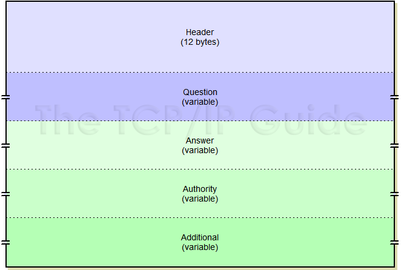
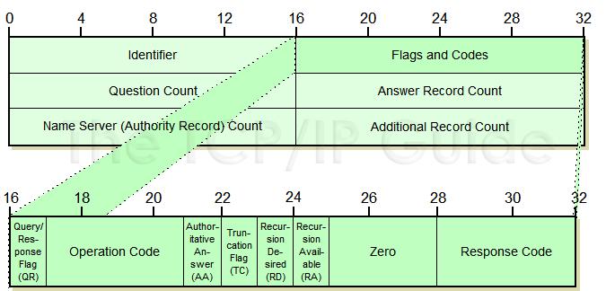
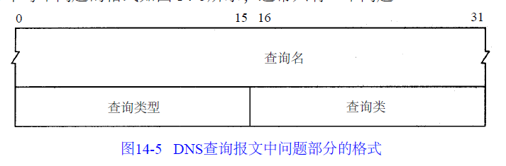
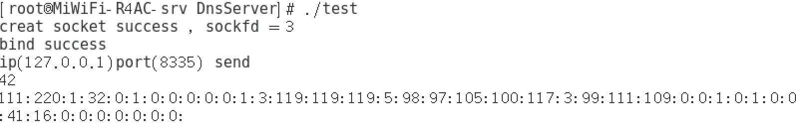

###DNS报文格式



###DNS报文头部的flag字段占据两个字节长度



###DNS报文头部的问题部分字段



###在CentOs环境下用C++写死了一个UDP端口的服务端程序接收dig发来的DNS请求，可以收到一个DNS
请求。


```
int main() {

    int sockfd = socket(AF_INET,SOCK_DGRAM,0);
    if(sockfd<0)
    {
       perror("socket"); 
        return -1;
    }
    else
    {
        printf("creat socket success , sockfd = %d\n",sockfd);
    }

    struct sockaddr_in seraddr,cliaddr;
    seraddr.sin_family = AF_INET;
    seraddr.sin_port = htons(8888);
    seraddr.sin_addr.s_addr = htonl(INADDR_ANY);

    int bind_ret = bind(sockfd,(struct sockaddr *)&seraddr,sizeof(struct sockaddr));
    if(bind_ret == -1)
    {
        perror("bind");
        close(sockfd);
        return -2;
    }
    else
    {
        printf("bind success\n");
    }

    uint8_t buf[BUF_SIZE];
    uint8_t sendbuf[BUF_SIZE];
    socklen_t len = sizeof(struct sockaddr);
    while(1)
    {
        
        memset(buf,0,BUF_SIZE);
        int count = recvfrom(sockfd,buf,sizeof(buf),0,(struct sockaddr *)&cliaddr,&len);
        int port = cliaddr.sin_port;
        printf("ip(%s)port(%d) send\n", inet_ntoa(cliaddr.sin_addr), port);
        printf("%d\n", count);
        for (int i = 0; i < count ;i++)cout<< (uint16_t)(buf[i])<<":";    
        printf("\n"); 
    }

    close(sockfd);
    return 0;
}
```
dig的命令：


服务端程序收到并且打印DNS请求



111:220:1:32:0:1:0:0:0:0:0:1:3:119:119:119:5:98:97:105:100:117:3:99:111:109:0:0:1:0:1:0:0:41:16:0:0:0:0:0:0:0:

可以看到这个是每个字节分开的完整DNS请求

####标识ID（111:220）

####标志（1:32）

####问题数（0:1）

####回答数（0:0）

####授权资源记录数（0:0）

####附加信息数（0:1）

####问题的name部分（3:119:119:119:5:98:97:105:100:117:3:99:111:109:）这个是我们要查询的域名，是重点，把它用ascii翻译过来就是（www.baidu.com)每一段开始的数字表示这个区域的名字长度，这表明这一个字段有三个域。

name部分的结束（0:）

问题部分的类型（0:1）这是因为我们在用dig发送请求时，是用A结尾发送请求这表明这个问题是需要用域名请求IP地址。

除此之外还有两个比较重要的就是

AAAA（0:28）结尾的IPV6请求

TXT记录（0:16），一般做一些验证记录时会使用此项，简单的说就是会返回一段字符串来做暗号。

####生存时间类型（TTL）（0:0:41:16:）这个记录可以保存的时长

####资源数据（0:0:0:0:0:0:0:）暂时没有用处

###关于数据类型的问题
为什么buf的类型是uint8_t呢，因为它是一个字节的数据类型，并且无符号刚好囊括了0-255的全部范围。其实它是unsigned char的别名，不直接用unsigned char是为了兼容各个操作系统。在打印的时候要转换成uint16_t否则会乱码。而且直接用char类型的buffer打印出的请求报文全是乱码，甚至不知道是否有数据收到，因为什么也不会打印出来，把请求报文转换成uint8_t节省了内存空间，并且方便了操作。
###在报文中会看到192这个数字，这个是因为报文都是经过压缩的，192 xxx代表这两个字节表示了报文中以xxx开头直到0位置的一段数据。
